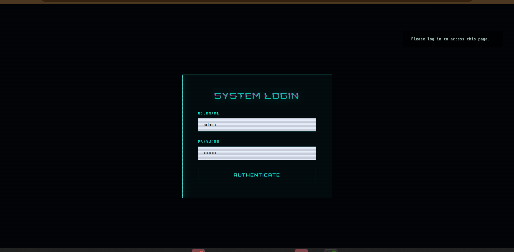
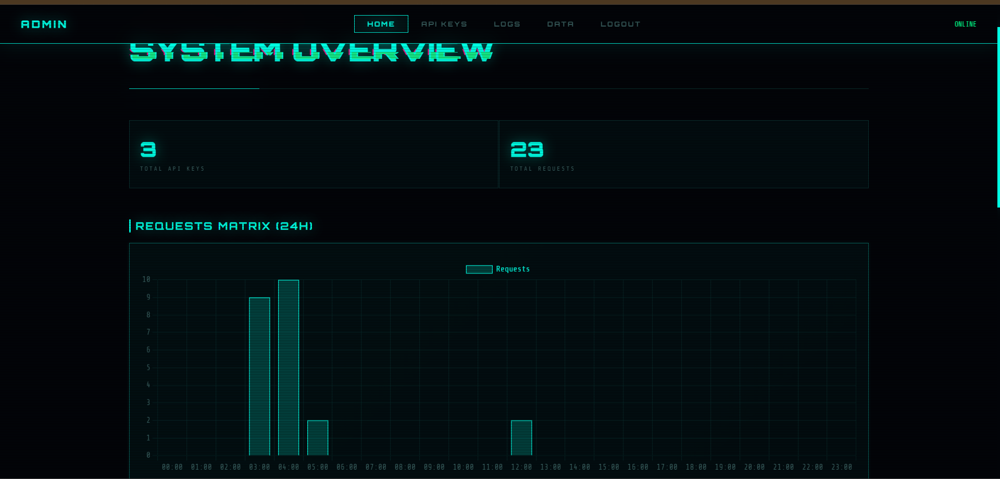
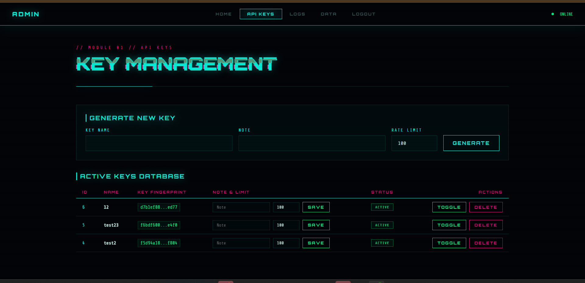
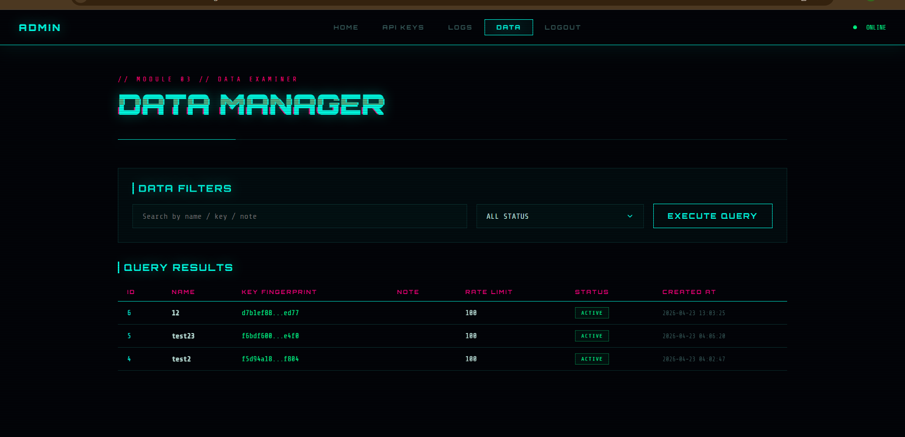
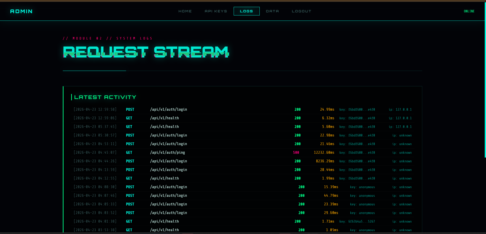

# API Gateway Backend

[](https://www.python.org/)
[](https://fastapi.tiangolo.com/)
[](LICENSE)

Hệ thống API Gateway được xây dựng với FastAPI, cung cấp các chức năng xác thực, quản lý người dùng, và routing cho các microservices.

## 🚀 Quick Start

Cách nhanh nhất để bắt đầu:

```bash
# 1. Chạy script cài đặt (tự động cài đặt tất cả)
setup.bat

# 2. Đảm bảo MySQL đang chạy và databases đã được tạo
#    - project_api_quangdev
#    - project_quangdev

# 3. Chạy ứng dụng
run.bat

# 4. Truy cập:
#    - API Gateway: http://localhost:5000
#    - Admin Panel: http://localhost:8080 (user: admin / pass: admin123)
```

## 📑 Mục lục

- [Tính năng chính](#tính-năng-chính)
- [Cấu trúc dự án](#cấu-trúc-dự-án)
- [Cài đặt](#cài-đặt)
- [Chạy ứng dụng](#chạy-ứng-dụng)
- [API Endpoints](#api-endpoints)
- [Hướng dẫn tích hợp](#hướng-dẫn-tích-hợp)
- [Security Best Practices](#security-best-practices)
- [Troubleshooting](#troubleshooting)
- [Admin Panel](#admin-panel)
- [Logging](#logging)
- [Hỗ trợ](#hỗ-trợ)
- [Đóng góp](#đóng-góp)
- [Changelog](#changelog)

## Tính năng chính

- **Xác thực JWT**: Hệ thống xác thực dựa trên JWT token với thời gian sống 24 giờ
- **Quản lý người dùng**: Đăng ký, đăng nhập, lấy thông tin user, thu hồi token
- **Middleware**: Authentication, Rate Limiting, Request Logging
- **CORS Support**: Hỗ trợ Cross-Origin Resource Sharing
- **Admin Panel**: Giao diện quản trị dựa trên Flask
- **Database Integration**: Kết nối MySQL với SQLAlchemy ORM
- **Health Check**: Endpoint kiểm tra trạng thái hệ thống

## Cấu trúc dự án

```
project-root/
├── api/                    # API routes
│   └── v1/                # API version 1
│       └── routers/       # Route handlers
│           ├── auth.py    # Auth endpoints
│           ├── health.py  # Health check
│           ├── users.py   # User endpoints
│           └── users_auth.py  # User authentication
├── core/                  # Core functionality
│   ├── auth_service.py    # Authentication logic
│   ├── config.py          # Configuration settings
│   └── database.py        # Database connection
├── middleware/            # Custom middleware
│   ├── auth.py           # Authentication middleware
│   ├── rate_limit.py     # Rate limiting
│   └── logging.py        # Request logging
├── admin/                # Admin panel (Flask)
├── modules/              # Additional modules
├── main.py              # Application entry point
├── requirements.txt     # Python dependencies
└── .env                 # Environment configuration
```

## Cài đặt

### 1. Clone dự án
```bash
git clone <repository-url>
cd project-root
```

### 2. Cài đặt Python dependencies

**Cách 1: Sử dụng script cài đặt (Khuyên dùng)**
```bash
setup.bat
```

Script này sẽ tự động:
- Tạo virtual environment (.venv)
- Cài đặt tất cả dependencies
- Copy `.env.example` sang `.env` (nếu chưa có)
- **Tự động generate các secret keys ngẫu nhiên và an toàn**

**Cách 2: Cài đặt thủ công**
```bash
pip install -r requirements.txt
```

Sau đó phải cấu hình thủ công file `.env` (xem phần bên dưới)

### 3. Cấu hình Database

#### Cài đặt MySQL
Đảm bảo MySQL đã được cài đặt và đang chạy.

#### Tạo Database
```sql
CREATE DATABASE project_api_quangdev;
CREATE DATABASE project_quangdev;
```

Hoặc chạy file SQL có sẵn:
```bash
mysql -u root -p < database.sql
mysql -u root -p < dataproject.sql
```

### 4. Cấu hình Environment Variables

**⚠️ Quan trọng:** File `.env.example` là template và KHÔNG nên sửa trực tiếp. Script `setup.bat` sẽ tự động copy nó sang `.env` và điền các secret keys.

Nếu bạn đã chạy `setup.bat`, file `.env` đã được tạo tự động với các secret keys ngẫu nhiên. Bạn chỉ cần kiểm tra và cập nhật các thông tin sau nếu cần:

```env
# Database Configuration
DATABASE_URL=mysql+pymysql://root:@localhost:3306
DATABASE_API=project_api_quangdev
DATABASE_PROJECT=project_quangdev

# API Configuration
API_KEY_HEADER_NAME=x-api-key
LOG_LEVEL=INFO
API_KEYS=dev-api-key

# Server Configuration
API_PUBLIC=5000
API_ADMIN=8080

# Admin Configuration
ADMIN_USERNAME=admin
ADMIN_PASSWORD=admin123

# Security Configuration
ADMIN_SECRET_KEY=<đã được tự động generate bởi setup.bat>
FLASK_SESSION_SECRET=<đã được tự động generate bởi setup.bat>
JWT_SIGNING_SECRET=<đã được tự động generate bởi setup.bat>

# Logging Configuration
LOG_FILE_PATH=api_gateway.log
```

**⚠️ Lưu ý quan trọng:**
- Nếu cài đặt thủ công (không dùng setup.bat), bạn PHẢI điền 3 secret keys trên
- Các secret keys đã được generate tự động là an toàn cho development
- Trong môi trường production, nên sử dụng các secret keys mạnh hơn và bảo mật
- **KHÔNG bao giờ commit file `.env` vào version control** (nên thêm `.env` vào `.gitignore`)

## Chạy ứng dụng

### Windows
```bash
run.bat
```

### Manual
```bash
python main.py
```

Ứng dụng sẽ chạy tại:
- **API Gateway**: `http://localhost:5000`
- **Admin Panel**: `http://localhost:8080`

## API Endpoints

### Base URL
```
http://localhost:5000/api/v1
```

### Public Endpoints

#### Health Check
```http
GET /health
```
Response:
```json
{
  "status": "ok"
}
```

#### Auth Ping
```http
GET /auth/ping
```
Response:
```json
{
  "module": "auth",
  "status": "ok"
}
```

#### Users Ping
```http
GET /users/ping
```
Response:
```json
{
  "module": "users",
  "status": "ok"
}
```

### Authentication Endpoints

#### Đăng ký người dùng
```http
POST /auth/register
Content-Type: application/json

{
  "username": "testuser",
  "email": "test@example.com",
  "password": "password123",
  "full_name": "Test User"
}
```
Response (201):
```json
{
  "id": 1,
  "username": "testuser",
  "email": "test@example.com",
  "full_name": "Test User",
  "is_active": true
}
```

#### Đăng nhập
```http
POST /auth/login
Content-Type: application/json

{
  "username": "testuser",
  "password": "password123"
}
```
Response:
```json
{
  "access_token": "eyJhbGciOiJIUzI1NiIsInR5cCI6IkpXVCJ9...",
  "token_type": "bearer",
  "user": {
    "id": 1,
    "username": "testuser",
    "email": "test@example.com",
    "full_name": "Test User",
    "is_active": true
  }
}
```

#### Lấy thông tin user hiện tại
```http
GET /auth/me
Authorization: Bearer <access_token>
```
Response:
```json
{
  "id": 1,
  "username": "testuser",
  "email": "test@example.com",
  "full_name": "Test User",
  "is_active": true
}
```

#### Thu hồi token
```http
POST /auth/revoke
Authorization: Bearer <access_token>
```
Response:
```json
{
  "message": "Token revoked"
}
```

## Hướng dẫn tích hợp

### 1. Tích hợp với Frontend

#### Cấu hình CORS
Thêm domain của frontend vào file `.env`:
```env
CORS_ALLOW_ORIGINS=http://localhost:3000,https://your-frontend-domain.com
CORS_ALLOW_CREDENTIALS=true
CORS_ALLOW_HEADERS=*
```

#### Gọi API từ Frontend
```javascript
// Đăng ký
const register = async (userData) => {
  const response = await fetch('http://localhost:5000/api/v1/auth/register', {
    method: 'POST',
    headers: {
      'Content-Type': 'application/json',
    },
    body: JSON.stringify(userData),
  });
  return response.json();
};

// Đăng nhập
const login = async (credentials) => {
  const response = await fetch('http://localhost:5000/api/v1/auth/login', {
    method: 'POST',
    headers: {
      'Content-Type': 'application/json',
    },
    body: JSON.stringify(credentials),
  });
  const data = await response.json();
  
  // Lưu token
  localStorage.setItem('access_token', data.access_token);
  return data;
};

// Gọi API với token
const getCurrentUser = async () => {
  const token = localStorage.getItem('access_token');
  const response = await fetch('http://localhost:5000/api/v1/auth/me', {
    headers: {
      'Authorization': `Bearer ${token}`,
    },
  });
  return response.json();
};
```

### 2. Tích hợp với Microservices

#### Thêm route mới
Tạo file mới trong `api/v1/routers/`:

```python
# api/v1/routers/your_service.py
from fastapi import APIRouter

router = APIRouter(prefix="/your-service", tags=["your-service"])

@router.get("/endpoint")
def your_endpoint():
    return {"status": "ok", "data": "your data"}
```

Đăng ký route trong `api/v1/__init__.py`:
```python
from .routers import your_service_router

router.include_router(your_service_router)
```

#### Sử dụng Middleware
Middleware được áp dụng theo thứ tự sau trong `main.py`:
1. CORS
2. AuthenticationMiddleware
3. RateLimitMiddleware
4. RequestLoggingMiddleware

### 3. Tích hợp với Web Test Interface

Sử dụng web test interface tại `../web-test-api` để test API Gateway:

1. Cấu hình file `.env` trong web-test-api:
```env
API_URL = http://localhost:5000/api/v1
API_KEY = dev-api-key
WEB_PUBLIC = 3456
```

2. Chạy web test interface:
```bash
cd ../web-test-api
run.bat
```

3. Truy cập `http://localhost:3456` để test các endpoint

### 4. Sử dụng API Key

Để bảo vệ các endpoint, thêm header API key vào request:

```http
x-api-key: dev-api-key
```

Hoặc cấu hình nhiều API keys trong `.env`:
```env
API_KEYS=dev-api-key,prod-api-key,test-api-key
```

## Security Best Practices

1. **Luôn sử dụng HTTPS trong production**
2. **Thay đổi tất cả secret keys trong môi trường production**
3. **Sử dụng environment variables thay vì hardcode credentials**
4. **Implement rate limiting để prevent DDoD attacks**
5. **Log và monitor tất cả requests**
6. **Regularly update dependencies**
7. **Sử dụng strong password policies**

## Troubleshooting

### Database connection error
Kiểm tra:
- MySQL service đang chạy
- Database credentials trong `.env` đúng
- Database đã được tạo

### CORS error
Kiểm tra:
- CORS_ALLOW_ORIGINS trong `.env` đúng
- Frontend domain được thêm vào danh sách cho phép

### Authentication error
Kiểm tra:
- Token hợp lệ và chưa hết hạn
- Authorization header đúng format: `Bearer <token>`
- JWT_SIGNING_SECRET khớp giữa các services

## Admin Panel

Admin Panel là giao diện quản trị dựa trên Flask giúp bạn quản lý hệ thống API Gateway một cách trực quan.

### Truy cập Admin Panel

- **URL**: `http://localhost:8080`
- **Default credentials:**
  - Username: `admin`
  - Password: `admin123`

**⚠️ Lưu ý:** Thay đổi password mặc định sau lần đăng nhập đầu tiên!

### Giao diện Admin Panel

#### 1. Trang Đăng nhập


#### 2. Trang chủ (Dashboard)


Dashboard hiển thị tổng quan về hệ thống:
- Thống kê requests
- Trạng thái các dịch vụ
- Thông tin hệ thống

#### 3. Quản lý API Keys


Tại đây bạn có thể:
- Xem danh sách API keys đang hoạt động
- Thêm API key mới
- Xóa hoặc vô hiệu hóa API key
- Xem lịch sử sử dụng của từng key

#### 4. Quản lý Dữ liệu


Quản lý dữ liệu hệ thống:
- Xem và quản lý users
- Quản lý permissions
- Xem thống kê dữ liệu

#### 5. Xem Logs


Theo dõi và quản lý logs:
- Xem logs real-time
- Lọc logs theo level (INFO, WARNING, ERROR)
- Tìm kiếm logs
- Export logs

### Tính năng Admin Panel

- **Dashboard**: Tổng quan hệ thống và thống kê
- **API Key Management**: Quản lý các API keys cho truy cập
- **User Management**: Quản lý người dùng và permissions
- **Logs Viewer**: Xem và filter logs hệ thống
- **System Monitoring**: Theo dõi trạng thái các services
- **Configuration**: Cấu hình hệ thống

## Logging

Logs được ghi vào file `api_gateway.log` (có cấu hình trong `.env`)

Kiểm tra logs để debug:
```bash
tail -f api_gateway.log
```

## License

[Your License Here]

---

## 📞 Hỗ trợ

Nếu bạn gặp vấn đề hoặc có câu hỏi:
- Kiểm tra section [Troubleshooting](#troubleshooting)
- Xem logs trong file `api_gateway.log`
- Kiểm tra Admin Panel để xem trạng thái hệ thống

## 📝 Changelog

### Version 1.0.0
- Phiên bản đầu tiên
- JWT Authentication
- User Management
- Admin Panel
- API Key Management
- Logging System
- Rate Limiting
